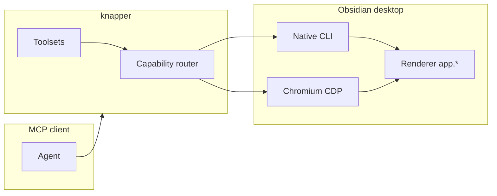

# knapper

MCP server that drives a **live Obsidian desktop app** for plugin development. It provides native CLI commands, fenced browser automation, telemetry, and plugin development tools through one guarded session.

_Knapping is the craft of shaping obsidian into tools._

> This project is not affiliated with Obsidian or Dynalist Inc. “Obsidian” is a trademark of Dynalist Inc.

## Platform support

**knapper is developed and tested on Linux only. It may not work elsewhere.**

Nothing here is deliberately Linux-specific, and macOS and Windows paths exist
throughout — but they are written from documentation rather than measured against a
running app, and no live suite has ever executed on either. Treat them as untested.
Bug reports and fixes from other platforms are welcome.

| Platform    | Status   | Notes                                                                                                             |
| ----------- | -------- | ----------------------------------------------------------------------------------------------------------------- |
| **Linux**   | Tested   | Every live suite runs here. See [docs/verified-environment.md](docs/verified-environment.md) for the exact build. |
| **macOS**   | Untested | Most tools should work. Private sessions are not verified.                                                        |
| **Windows** | Untested | Live use is not verified.                                                                                         |

Knapper uses one managed Obsidian session. Private profile isolation still matters
when Knapper starts a test instance. Each private instance needs its own CLI socket.

| Platform | Socket keyed on                      | Isolation                                    |
| -------- | ------------------------------------ | -------------------------------------------- |
| Linux    | `$XDG_RUNTIME_DIR`                   | **per-session** — the environment selects it |
| macOS    | `os.homedir()`, environment excluded | shared, only via a `HOME` override, unproven |
| Windows  | `\\.\pipe\obsidian-cli-<username>`   | **impossible** — no environment input at all |

Knapper refuses any launch that cannot isolate the private profile and CLI socket.
It never routes a call to an unverified Obsidian process.

CI runs `ubuntu-latest` only, and covers lint, types, unit tests, and a packaged
install. The live suites need a real desktop Obsidian and run on a maintainer's
Linux machine.

## Why two transports?

Obsidian exposes two complementary automation surfaces. The server uses both; each tool picks the layer that can actually perform the work.

| Transport               | Enables                                                                                                                              | Tradeoffs                                                                                                                                                                          |
| ----------------------- | ------------------------------------------------------------------------------------------------------------------------------------ | ---------------------------------------------------------------------------------------------------------------------------------------------------------------------------------- |
| **Obsidian CLI**        | ~100+ purpose-built commands, plugin reload, vault-scoped ops, live `__completions` (including plugin `registerCliHandler` commands) | Requires global `"cli": true` in `obsidian.json`. Cannot run headlessly. When disabled, stdout is literally `Command line interface is not enabled.` (exit 0).                     |
| **Playwright over CDP** | Real mouse/keyboard input, actionability waiting, ARIA snapshots (`browser_*`), live console/network capture                         | Obsidian must be **cold-started** with `--remote-debugging-port`. Electron’s single-instance lock means adding the flag to an already-running app does nothing — fully quit first. |

Both can be active at the same time ([verified](docs/verified-environment.md)).



## Install

Requires **Node.js 20+**, **Obsidian 1.12+**, and — realistically — **Linux**; see
[Platform support](#platform-support).

**knapper is not published to npm or any other registry.** It installs from GitHub,
either as a pinned release tarball or straight from the default branch. See
[docs/hosts.md](docs/hosts.md) for what each host reads and how the plugin bundle is
discovered.

This repo ships two separable things: the **MCP server** (the tools) and a **plugin
bundle** (4 skills, 2 slash commands, an agent, and a rules file) that teaches an
agent how to drive them. Install the server alone, or both.

### Pinned — recommended

Install a specific release tarball, then point your client at the `knapper` binary:

```bash
npm i -g https://github.com/bearfire-dev/knapper/releases/download/v0.7.0-beta.1/knapper-0.7.0-beta.1.tgz
```

```json
{
  "mcpServers": {
    "knapper": { "command": "knapper" }
  }
}
```

Every release attaches its tarball as an asset, so the URL is stable and the version
is explicit. Nothing rebuilds at runtime.

### Convenience — track the default branch

npm installs git specs natively and runs this package's `prepare` script, which
builds the TypeScript on install:

```json
{
  "mcpServers": {
    "knapper": { "command": "npx", "args": ["-y", "github:bearfire-dev/knapper"] }
  }
}
```

This needs `git` on your machine and costs a TypeScript build on first run. It also
tracks whatever is on the default branch rather than a release, so prefer the pinned
form for anything you depend on.

The build happens in a `prepare` lifecycle script. If your npm is configured to
block install scripts (`--ignore-scripts`, or npm 11's script approval prompt),
`dist/` never gets built and the server fails to start — use the pinned tarball
instead, which ships `dist/` prebuilt and runs no scripts.

### Cursor

Add it in **Settings → MCP**, or drop [`.mcp.json`](.mcp.json) at your project root
with either config above.

Cursor cannot install plugins from an arbitrary Git repo — the marketplace is
curated. To get the skills, use [skills.sh](#skills-only) below, or clone this repo
into `~/.cursor/plugins/local/knapper` and reload the window.

### Claude Code

```bash
# MCP server (user scope; use --scope project to write .mcp.json instead)
claude mcp add --scope user --transport stdio knapper -- npx -y github:bearfire-dev/knapper

# Plugin bundle: skills, commands, agent, rules
claude plugin marketplace add bearfire-dev/knapper
claude plugin install knapper@knapper
```

The `--` before `npx` is required. The two marketplace commands are also available
as `/plugin marketplace add …` and `/plugin install …` inside a session.

### Codex

```bash
codex mcp add knapper -- npx -y github:bearfire-dev/knapper

codex plugin marketplace add bearfire-dev/knapper
codex plugin add knapper@knapper
```

Or write `~/.codex/config.toml` by hand:

```toml
[mcp_servers.knapper]
command = "npx"
args = ["-y", "github:bearfire-dev/knapper"]
```

### OpenCode

OpenCode requires a command array. Put environment variables in the `environment`
object. See [docs/hosts.md](docs/hosts.md) for a tested configuration.

### Skills only

To take the skills without the MCP server — they are plain `SKILL.md` files and
work in any host that reads the `.agents` convention:

```bash
npx skills add bearfire-dev/knapper
```

### Any other MCP client

Run `knapper` (pinned install) or `npx -y github:bearfire-dev/knapper` over stdio. Every
client that speaks MCP takes some form of the `command` + `args` pair shown above.

The `knap` binary remains as a compatibility alias. New configurations must use
`knapper`.

### From source

```bash
git clone https://github.com/bearfire-dev/knapper.git
cd knapper
npm install    # the prepare script builds dist/ for you
```

Then point your client at `node /absolute/path/to/dist/cli.js`.

## First run

Start one session before you use Obsidian:

1. Call **`obsidian_session_open`** with the plugin source and ID when you need a private test session.
2. Call **`obsidian_status`** to confirm that the session is `self` and that the target is ready.
3. Apply the fixes that doctor names. These are usually **`obsidian_setup_cli`** and
   **`obsidian_launch`** for the default profile. Private sessions start ready.

Then the development loop: **`obsidian_link_plugin`** to symlink your build output
into a vault, build, and **`obsidian_dev_cycle`** to reload the plugin and report
back any console errors attributed to it.

If you installed the plugin bundle, the `obsidian-instance-setup` and
`obsidian-plugin-dev` skills walk an agent through this without you prompting it.

## Vault access

knapper refuses to touch any vault you have not authorized. Fresh out of the box it
can reach nothing, and every vault-scoped tool answers `VAULT_NOT_AUTHORIZED` until
you say otherwise.

```text
knapper authorizations              # what knapper may touch
knapper authorize ~/vaults/scratch  # grant access (interactive)
knapper revoke ~/vaults/scratch     # withdraw it
```

`authorize` runs in **your** terminal, not through a tool. It requires an interactive
TTY and makes you retype the vault name, so an agent cannot complete it even though
it can spawn the binary — the grant has to come from a person. `revoke` bites
immediately, without restarting the server.

Authorizing is a real grant: it lets any agent driving knapper read every note in
that vault into its context, edit or delete notes, and run arbitrary JavaScript
against it. For experiments, make throwaway space instead — see below.

`obsidian_doctor` and `obsidian_status` show which vaults are authorized and how, so
an agent can diagnose a refusal without guessing.

`obsidian_create_vault` refuses when a private session is selected. Use the scratch
vault that `obsidian_session_open` creates for that session.

## Stateless session use

The MCP tool list is fixed during initialization. It includes the UI and plugin
tools that an agent needs. Knapper does not send `notifications/tools/list_changed`.

Call `obsidian_session_open` to create or reuse one managed session. Operational
tools use that session automatically. They do not accept caller-owned session
identifiers.

Call `obsidian_session_status` to inspect the session. Call `obsidian_session_release`
to stop it and keep its scratch vault. Call `obsidian_session_reset` to stop the
session and create a new private target. Knapper moves verified private roots to
recoverable trash when cleanup requires removal. It never hard-deletes them.

Only one operation runs at a time. A second Knapper process receives `KNAPPER_BUSY`.
`obsidian_status` reports `free`, `self`, `busy`, or `stale`, with the last activity
time and a retry interval. Knapper reclaims a stale owner after it verifies process
death or an expired activity record.

Use the default profile only after the user approves it and the vault is authorized.
Knapper keeps the profile and `XDG_RUNTIME_DIR` private for managed sessions.

## Configuration

Set options via **environment variables** (and a subset via CLI flags). See [docs/configuration.md](docs/configuration.md) for examples.

| Setting             | Env var                  | CLI flag         | Default                        |
| ------------------- | ------------------------ | ---------------- | ------------------------------ |
| CDP URL             | `OBSIDIAN_CDP_URL`       | `--cdp-url`      | `http://127.0.0.1:9222`        |
| Obsidian binary     | `OBSIDIAN_BIN`           | `--obsidian-bin` | OS default                     |
| Default vault       | `OBSIDIAN_VAULT`         | `--vault`, `-v`  | (active / unset)               |
| Toolsets            | `KNAP_TOOLSETS`          | `--toolsets`     | `all`                          |
| knapper's disk root | `KNAP_HOME`              | —                | `~/.knapper_mcp`               |
| Log level           | `KNAP_LOG_LEVEL`         | `--log-level`    | `info`                         |
| Telemetry buffer    | `KNAP_TELEMETRY_BUFFER`  | —                | `2000`                         |
| Network capture     | `KNAP_TELEMETRY_NETWORK` | —                | `false`                        |
| CDP reconnect delay | `KNAP_RECONNECT_MS`      | —                | `2000`                         |
| Screenshot dir      | `KNAP_SCREENSHOT_DIR`    | `--output-dir`   | `./.knapper`                   |
| CLI timeout         | `KNAP_CLI_TIMEOUT_MS`    | —                | `15000`                        |
| Session cleanup     | `KNAP_IDLE_TIMEOUT_MS`   | —                | `86400000` (24 hours)          |
| Activity ownership  | `KNAP_ACTIVITY_IDLE_MS`  | —                | `300000` (5 minutes)           |
| Command transport   | `KNAP_COMMAND_TRANSPORT` | —                | `auto` (`cli` or `playwright`) |
| Window match        | `OBSIDIAN_TARGET_MATCH`  | `--target-match` | (unset)                        |
| Transport           | `MCP_TRANSPORT`          | `--transport`    | `stdio`                        |
| HTTP port           | `MCP_PORT`               | `--port`         | `9223`                         |
| HTTP host           | `MCP_HOST`               | `--host`         | `127.0.0.1`                    |

`LOG_LEVEL`, `RECONNECT_MS`, and `SCREENSHOT_DIR` are also accepted as aliases; the `KNAP_`-prefixed name wins when both are set.

When a session selects a private target, screenshots use that target's own
`output/` directory. A requested screenshot path must be relative to the configured
output root. Screenshot tools return a file path and never return inline base64 data.

Tools publish MCP output schemas and return machine-readable `structuredContent`.
Clients do not need to parse the display text.

The default `stdio` transport is what MCP clients use. HTTP is experimental and
uses one global lane. `--transport http` serves MCP at `/mcp` (for example
`http://127.0.0.1:9223/mcp`). Each request uses the active session.
The listener can bind only to `127.0.0.1` or `::1`. It cannot bind to a wildcard,
LAN address, or the `localhost` name. Requests can use `localhost`, `127.0.0.1`,
or `[::1]` in their `Host` and `Origin` headers. The server has no authentication.
Details are in [docs/configuration.md](docs/configuration.md).

Cursor plugin `variables` and Claude `userConfig` do not unify across hosts — use plain env vars in each MCP config.

## Toolsets

Gating keeps tool count manageable for model tool selection.

| Toolset      | Startup | Description                                                                                                          |
| ------------ | ------- | -------------------------------------------------------------------------------------------------------------------- |
| `core`       | no      | Status, doctor, launch, eval, CLI, commands, attach                                                                  |
| `session`    | yes     | One managed session and its lifecycle operations                                                                     |
| `ui`         | no      | Fenced `browser_*` tools for real UI interaction, plus `obsidian_snapshot`                                           |
| `telemetry`  | no      | Console/error/network capture, cursor tailing                                                                        |
| `plugin-dev` | no      | Reload, manifest/settings, `obsidian_dev_cycle`, exercise/reset                                                      |
| `editor`     | no      | Active-editor state, cursor/selection control, hash-guarded text edits, widget queries                               |
| `vault`      | no      | Note/file CRUD, search, tabs, graph queries — **opt-in** because other Obsidian MCP servers already cover vault CRUD |
| `devtools`   | no      | DOM/CSS/CDP passthrough, OS-window screenshots, mobile emulation                                                     |
| `authoring`  | no      | Themes, snippets, properties, tags, tasks, daily notes, templates                                                    |

Knapper publishes the complete startup surface during MCP initialization. The tool
list does not change during a connection. Do not change the tool list after startup.
The fixed surface includes session lifecycle, status, plugin development, telemetry,
editor, UI, and opt-in vault tools.

### Representative tools

**Core & provisioning:** `obsidian_status`, `obsidian_doctor`, `obsidian_launch`, `obsidian_setup_cli`, `obsidian_setup_vault`, `obsidian_link_plugin`, `obsidian_list_targets`, `obsidian_attach`, `obsidian_eval`, `obsidian_cli`, `obsidian_commands`, `obsidian_command`

**Session:** `obsidian_session_open`, `obsidian_session_status`, `obsidian_session_release`, `obsidian_session_reset`

**Plugin dev:** `obsidian_plugin_list`, `obsidian_plugin_manifest`, `obsidian_plugin_settings`, `obsidian_plugin_reload`, `obsidian_dev_cycle`, `obsidian_exercise_command`, `obsidian_reset_state`, `obsidian_plugin_health`

**Telemetry:** `obsidian_logs`, `obsidian_log_mark`, `obsidian_logs_clear`, `obsidian_telemetry_status`

**Editor (opt-in):** `obsidian_editor_state`, `obsidian_editor_set`, `obsidian_editor_replace`, and `obsidian_editor_widgets`

**UI (opt-in):** `obsidian_snapshot`, `obsidian_element_screenshot`, `browser_snapshot`, `browser_click`, `browser_type`, `browser_press_key`, and `browser_take_screenshot`. Knapper withholds navigation, raw evaluation, tab control, file upload, and similar unsafe browser tools.

**Vault (opt-in):** `obsidian_search`, `obsidian_read`, `obsidian_create`, and related file/note tools

**Authoring (opt-in):** `obsidian_properties`, `obsidian_tags`, `obsidian_tasks`, themes, daily notes

Browser tools are **snapshot-first**: call `browser_snapshot` (or the cheaper scoped `obsidian_snapshot`), then pass the returned ref as **`target`** (CSS selectors also work there). Prefer `obsidian_command` over menu clicking.

## Troubleshooting

`obsidian_doctor` classifies failures into four distinct precondition states — do not treat them as a generic “cannot connect”:

| State                    | Symptom                                                                   | Fix                                                                                     |
| ------------------------ | ------------------------------------------------------------------------- | --------------------------------------------------------------------------------------- |
| **Obsidian not running** | `OBSIDIAN_NOT_RUNNING`                                                    | `obsidian_launch`                                                                       |
| **CLI disabled**         | `CLI_DISABLED`, or stdout marker `Command line interface is not enabled.` | `obsidian_setup_cli` or Settings → Advanced → Command line interface                    |
| **CDP port closed**      | `CDP_PORT_CLOSED`, attach timeouts                                        | Quit Obsidian completely; cold start with `--remote-debugging-port` (`obsidian_launch`) |
| **Argv corruption**      | `ARGV_CORRUPTION`, `Command "-foo" not found`                             | Fix `user-flags.conf` to use `--double-dash` flags                                      |
| **Session busy**         | `KNAPPER_BUSY`                                                            | Wait for the retry interval, then call `obsidian_status`                                |

Launch failures use `OBSIDIAN_LAUNCH_FAILED`. The error includes the exit signal, exit code, and bounded launch output when available.

Also:

- **Several MCP hosts are active** — Knapper permits one operation at a time. Use `obsidian_status` to see the owner state and retry interval.
- **Every CLI call fails with `Cannot find module 'electron'`** — something set `ELECTRON_RUN_AS_NODE=1` in the environment knapper inherited, which makes the Obsidian binary start as a bare Node process. Electron-based MCP clients (Claude Code, Cursor, VS Code, Claude Desktop) set it for their child processes. knapper strips it before spawning, so if you still see this, a wrapper script or shell profile is re-adding it downstream.
- **Unavailable `browser_*` calls** — enabled browser tools stay visible when Obsidian is offline. The call returns `CDP_PORT_CLOSED` with `obsidian_launch` remediation. Cold-start Obsidian with the debug port, then retry the same tool.
- **`VAULT_NOT_FOUND`** — vault name not in the `obsidian.json` registry.
- **`SESSION_NOT_FOUND`** — the managed session no longer exists. Call `obsidian_session_open` to create it again. Knapper never falls back to the default profile.
- **Stale UI refs** — `STALE_REF`; take a new `browser_snapshot`.
- **Linux wrappers** — single-dash tokens in `user-flags.conf` break every CLI call.

## Version drift caveat

Obsidian checks for updates on startup and hourly. A downloaded `obsidian-<version>.asar` in userData takes precedence over the distro package, so DOM and API behavior can drift from the version your package manager reports. Re-run doctor and UI smoke tests after upgrades.

Doctor reports explicit version sources in `versions`. The fields are `running`,
`downloadedAsar`, `installedPackage`, and `installedPackageSource`. The
`comparisons` object contains `runningVsDownloaded`, `runningVsInstalled`, and
`downloadedVsInstalled`. Each comparison is `match`, `different`, or `unavailable`.

## Development

```bash
npm install          # installs the pinned toolchain too, no global tools needed
npm run check        # format + lint (oxfmt / oxlint via vite-plus)
npm run typecheck    # tsc --noEmit
npm test             # unit tests (vitest)
npm run build        # tsc -> dist/
npm run smoke        # degraded-mode MCP check; needs no Obsidian
```

Five suites drive a real desktop Obsidian, so none of them run in CI. Each suite
creates a temporary private profile, a dynamic CDP port, and a disposable vault:

```bash
npm run acceptance   # fast gate over the critical seams
npm run e2e          # deep end-to-end: vault round-trips, UI, telemetry, dev cycle
npm run fence        # refusals against a genuinely unauthorized vault
npm run bg-input     # input delivery while Obsidian is not the focused window
npm run workspaces   # session ownership, reconnect, restart, quarantine
```

The suites do not need a pre-launched Obsidian instance or an existing scratch
vault. They verify registry preservation and safe cleanup. Run `npm run workspaces`
for changes to `src/session/`, session ownership, or process-scoping predicates.

`npm run bg-input` is only meaningful when Obsidian is not the foreground window.
Run it without clicking the private Obsidian window.

## Branching model

```
feature/*  ──PR──▶  dev  ──PR──▶  master
                                    │
                                 release
                                  (tag)
```

- **`dev`** is the default branch and the target for all feature PRs.
- **`master`** is production, and only advances by a promotion PR from `dev`.
- Both branches require a passing CI run; neither accepts a direct push.

Installing `github:bearfire-dev/knapper` tracks the repository default branch.
For a reproducible production install, use a release tarball URL from
[Install](#install).

## Releasing

`package.json` is the single source of truth for the version. The same string is
mirrored into the three plugin manifests, so it is synced by script rather than by
hand:

```bash
npm run versions:sync    # rewrite every manifest from package.json
npm run versions:check   # CI gate: fail on drift
```

**Production (`master`)** — the bump is an ordinary change, so it goes through the
same flow as anything else:

```bash
git checkout -b release/v0.7.0-beta.1 dev
npm version 0.7.0-beta.1 --no-git-tag-version && npm run versions:sync
# PR into dev, then promote dev -> master
```

Once the promotion PR merges, cut the release either way:

- **From the Actions tab** — run the _Release_ workflow. It tags master's current HEAD with the version already in `package.json`, packs the tarball, and creates the GitHub Release with that tarball attached. Tick _dry run_ to rehearse. It refuses if that version is already tagged.
- **From a tag** — `git tag -s v0.7.0-beta.1 && git push origin v0.7.0-beta.1`.

Either way the workflow refuses to release a commit that is not on `master`, or a
tag that disagrees with `package.json`. It never pushes commits to `master`, which
is what lets branch protection stay strict.

The attached tarball is the **only** distribution artifact — there is no registry
behind it — so `npm pack` failing is a release failure, not a warning. No secrets
are needed beyond the automatic `GITHUB_TOKEN`.

## Security

This server drives your real Obsidian instance: it can execute arbitrary JavaScript
in the renderer (`obsidian_eval`), send real input, and modify vault files. Treat it
like granting desktop control.

Two boundaries apply. Your MCP client decides which **tools** may run; the vault
fence, enforced inside knapper, decides what those tools may **touch** — and that one
holds even if the client approves everything. Use a scratch vault for agent work,
review tool approvals in your client, and keep the HTTP transport on loopback. See
[SECURITY.md](SECURITY.md).

## License

MIT

## Origin

Knapper is a fork of [live-mcp-for-obsidian](https://github.com/gapmiss/live-mcp-for-obsidian)
by gapmiss.
